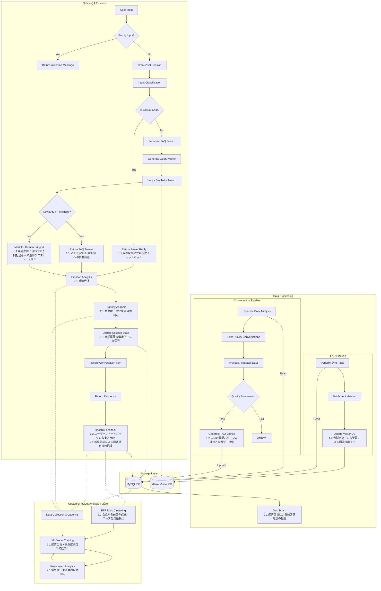

# Chatbot System Architecture

This document describes the architecture of our chatbot system, including the online QA process, data storage, and data processing pipelines.

## System Flow Diagram

## Architecture Components

### Online QA Process
- Natural Conversation (1.1 自然な会話が可能なチャットボット)
- FAQ Auto-response (1.1 よくある質問（FAQ）への自動回答)
- Human Support Escalation (1.1 複雑な問い合わせの人間担当者への適切なエスカレーション)
- Emotion Analysis (2.1 感情分析)
- Urgency Assessment (2.1 緊急度・重要度の自動判定)
- Structured Conversation History (1.1 会話履歴の構造化された保存)
- User Feedback Collection (1.2 ユーザーフィードバックの収集と反映)
- Customer Satisfaction Analysis (2.1 感情分析による顧客満足度の把握)

### Storage Layer
- MySQL Database
  - FAQ data and conversation history
  - Session and feedback management
  - Analytics and monitoring data
- Milvus Vector Database
  - Semantic vectors for enhanced search
  - Real-time query matching

### Data Processing
- FAQ Pipeline
  - Periodic data synchronization
  - Vector database updates (1.2 会話パターンの学習による回答精度向上)
  - Pattern learning and optimization
- Conversation Pipeline
  - Quality conversation filtering
  - Feedback data processing
  - New pattern detection (1.2 未知の質問パターンの検出と学習データ化)
  - Knowledge base enhancement
- Dashboard
  - System performance monitoring
  - Customer satisfaction tracking (2.1 感情分析による顧客満足度の把握)

### Customer Insight Analysis (Future Enhancement)
- Automated Issue Extraction (2.1 会話から顧客の課題・ニーズを自動抽出)
  - BERTopic clustering implementation
  - Category-based issue classification
  - Continuous pattern learning
- Hybrid Analysis System
  - Rule-based initial analysis (2.1 緊急度・重要度の自動判定)
  - ML model enhancement (2.1 感情分析・緊急度判定の精度向上)
  - Continuous model training
- Data Pipeline
  - Structured data collection
  - Quality assessment and labeling
  - Model performance monitoring

## Color Coding
- Orange: MySQL Database
- Blue: Milvus Vector Database
- Green: FAQ Update Process
- Yellow: Conversation Processing